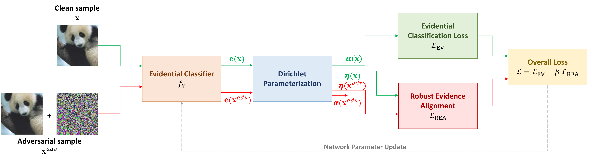
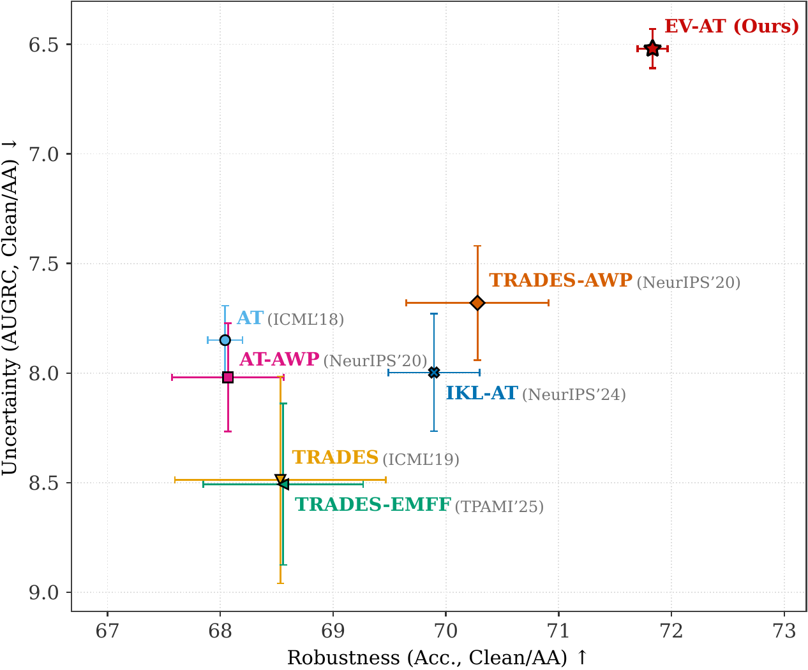
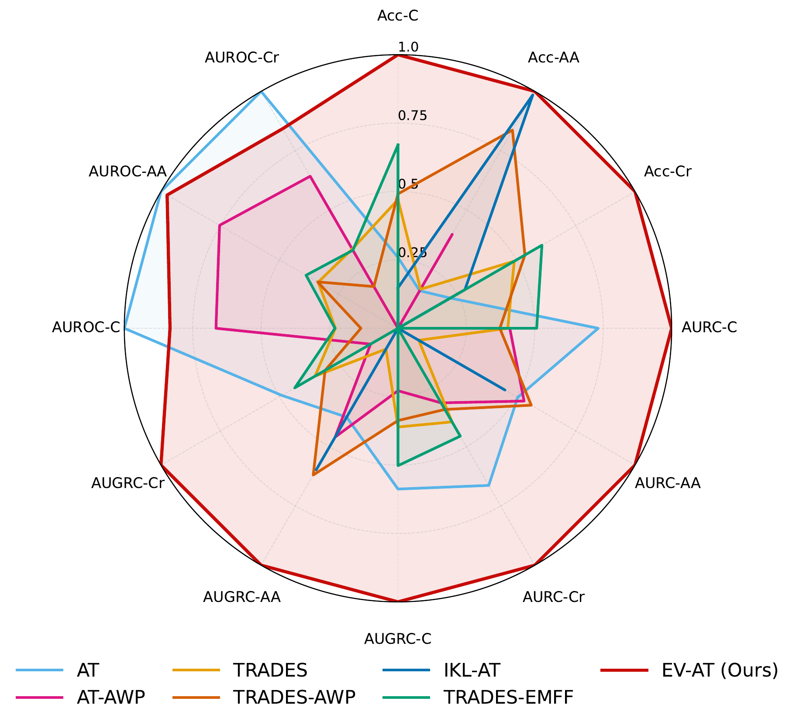

<div align="center">

# Robustness Meets Uncertainty

### Evidential Adversarial Training for Robust Selective Classification

**ECCV 2026**

[**Nicolas Sournac**](https://orcid.org/0009-0002-7610-7173)<sup>†</sup> ·
[**Ahmed Baha Ben Jmaa**](https://orcid.org/0009-0006-0333-2643)<sup>†</sup> ·
[**Bertrand Braeckeveldt**](https://orcid.org/0000-0002-5993-8883)

Multitel Research & Innovation Center, Artificial Intelligence Department, Belgium  
TRAIL — Trusted AI Labs, Belgium

<sup>†</sup> Equal contribution


<p align="center">
  <a href="https://arxiv.org/abs/<ARXIV_ID>">
    
  </a>
  <a href="<PROJECT_PAGE_URL>">
    
  </a>
  <a href="https://github.com/NicolasSournac/Robustness_Meets_Uncertainty.EV-AT">
    
  </a>
  <a href="#citation">
    
  </a>
  <a href="LICENSE">
    
  </a>
</p>

<p align="center">
  <a href="https://www.python.org/">
    
  </a>
  <a href="https://pytorch.org/">
    
  </a>
  <a href="https://lightning.ai/">
    
  </a>
  <a href="https://hydra.cc/">
    
  </a>
  <a href="https://docs.astral.sh/uv/">
    
  </a>
</p>

[**Overview**](#overview) ·
[**Results**](#main-results) ·
[**Quick Start**](#quick-start) ·
[**Use EV-AT**](#using-ev-at) ·
[**Benchmark**](#reproducing-the-benchmark) ·
[**Configure**](#configuration-system) ·
[**Extend**](#extending-the-benchmark) ·
[**Cite**](#citation)

</div>

> **EV-AT** (short for "Evidential Adversarial Training") is an adversarial training algorithm designed for trustworthy machine learning. The goal is to allow robust selective classification (jointly improving adversarial robustness and uncertainty ranking for selective classification).

<p align="center">
  
</p>

---

## Highlights

- **A unified evaluation benchmark** for predictive accuracy, adversarial
  robustness, and uncertainty quality across datasets, architectures,
  augmentation strategies, and threat models.

- **Evidential Adversarial Training (EV-AT),** a training objective that aligns
  clean and adversarial predictions in Dirichlet-parameter space to improve
  robust selective classification.

- **Comprehensive robustness evaluation** on clean inputs, AutoAttack, PGD,
  common corruptions, and both $\ell_\infty$ and $\ell_2$ threat models.

## News

- **June 2026:** EV-AT was accepted to ECCV 2026.
- **July 2026:** Code, configurations, and reproducibility benchmark released.


## Overview

Safety-critical classifiers should be able to do two things at once: **(1)** remain accurate under adversarial perturbations; and **(2)** identify predictions that should be rejected or deferred. Standard adversarial training primarily optimizes robust accuracy. This can improve the number of correct predictions under attack while still degrading the **ranking of predictive uncertainty**, leaving highly confident adversarial mistakes that are difficult to reject.

**Evidential Adversarial Training (EV-AT)** addresses this mismatch by representing class predictions as a Dirichlet distribution. For an input $\mathbf{x}$, the model predicts non-negative evidence $\mathbf{e}(\mathbf{x})$, which defines the concentration parameters $\boldsymbol{\alpha}(\mathbf{x}) = \mathbf{e}(\mathbf{x}) + \mathbf{1}$. EV-AT then optimizes an evidential classification objective together with **Robust Evidence Alignment (REA)** between clean and adversarial predictions in log-Dirichlet space: $\mathcal{L}_{\mathrm{EV\text{-}AT}} = \mathcal{L}_{\mathrm{EV}} + \beta\,\mathcal{L}_{\mathrm{REA}}$.

This repository provides:

| Capability | What is included |
|:--|:--|
| **Official EV-AT implementation** | Evidential adversarial training with robust evidence alignment. |
| **Controlled benchmark** | AT, AT-AWP, TRADES, TRADES-AWP, IKL-AT, TRADES-EMFF, and EV-AT under a shared protocol. |
| **Selective evaluation** | Accuracy, AURC, AUGRC, AUROC, risk–coverage behavior, and uncertainty ranking. |
| **Reproducible execution** | Locked dependencies, Hydra experiment recipes, deterministic seeds, single-run launchers, and benchmark job generation. |
<!-- | **Broad robustness coverage** | CIFAR-10/100, CIFAR-10/100-C, two architectures, four augmentation regimes, AutoAttack, PGD, and both $\ell_\infty$ and $\ell_2$ threat models. | -->

---
## Main Results

EV-AT achieves the strongest joint **robustness–uncertainty trade-off** among
the evaluated methods on **CIFAR-10 with WideResNet-34-10**.

Results are averaged over four data-augmentation strategies (Basic, Cutout,
AutoAugment, and AugMix) and three random seeds. Adversarial robustness is
evaluated with AutoAttack under the $\ell_\infty$ threat model with $\varepsilon = 8/255$.

<div align="center">

<table>
  <tr>
    <td width="54%" align="center">
      
    </td>
    <td width="46%" align="center">
      
    </td>
  </tr>
  <tr>
    <td align="center">
      <sub><b>(a)</b> Robustness–uncertainty trade-off</sub>
    </td>
    <td align="center">
      <sub><b>(b)</b> Multi-metric comparison</sub>
    </td>
  </tr>
</table>

<p>
  <strong>Robustness and uncertainty performance on CIFAR-10
  with WRN-34-10.</strong><br>
  EV-AT shifts the Pareto frontier toward higher robustness and more reliable
  uncertainty estimation.
</p>

</div>

## Quick Start

### Requirements

| Requirement | Recommended setting |
|:--|:--|
| Operating system | Linux or WSL2 with Bash |
| Python | 3.10.13 (`.python-version`) |
| Environment manager | [`uv`](https://docs.astral.sh/uv/) |
| Accelerator | NVIDIA GPU strongly recommended |
| PyTorch build | 2.2.1 using the CUDA 12.1 wheel index |
| Storage | Space for datasets, checkpoints, logs, and evaluation outputs |

> [!NOTE]
> The benchmark scripts are Bash-based. Native Windows users should run the project through WSL2 or an equivalent Linux environment.

### Installation

```bash
# Clone the official repository
git clone https://github.com/NicolasSournac/Robustness_Meets_Uncertainty.EV-AT.git
cd Robustness_Meets_Uncertainty.EV-AT

# Create the locked project environment
uv sync --frozen
source .venv/bin/activate

# Initialize local paths
cp .env.example .env
mkdir -p data out logs
```

To verify the installation:

```bash
python -c "import torch, lightning, hydra; print(torch.__version__)"
```

### Environment Setup

The code resolves storage paths through environment variables. Edit `.env.example` as needed:

```dotenv
DATA_PATH=./data/
EXP_PATH=./out/
LOG_PATH=./logs/
```

| Variable | Purpose |
|:--|:--|
| `DATA_PATH` | Dataset downloads and local caches. |
| `EXP_PATH` | Checkpoints, Lightning logs, and evaluation metrics. |
| `LOG_PATH` | General project logging path. |

CIFAR-10 and CIFAR-100 are downloaded automatically on first use. CIFAR-10-C and CIFAR-100-C are loaded through the Hugging Face `datasets` package and cached under `DATA_PATH`.

---

## Using EV-AT

The provided launchers are the safest way to run paper-compatible experiments. Direct Hydra commands are also available for custom research workflows.

### Training

Train EV-AT on CIFAR-10 with WideResNet-34-10, AugMix, and seed `0`:

```bash
python src/train.py --config-name train_config_evat \
  experiment.env_file=.env \
  experiment.name=cifar10_evat_augmix \
  experiment.dataset=cifar10 \
  experiment.num_classes=10 \
  experiment.seed=0 \
  experiment.beta=20 \
  experiment.max_reg_factor=0.1 \
  experiment.reg_scheduler_gamma=0.002 \
  dataloaders.aug=augmix \
  loss=expected_nll_loss \
  model=wideresnet_34_10 \
  proxy=wideresnet_34_10_proxy \
  step=fit
```

For CIFAR-100, use:

```text
experiment.dataset=cifar100
experiment.num_classes=100
experiment.beta=150
```

For a one-command train-and-evaluate workflow, use the job launcher:

```bash
cd jobs
bash run_single_job.sh wideresnet_34_10 cifar10 augmix evat 0
```

The launcher interface is:

```text
bash run_single_job.sh <MODEL> <DATASET> <AUGMENTATION> <PIPELINE> <SEED>
```

| Argument | Available values |
|:--|:--|
| `MODEL` | `wideresnet_34_10`, `preactresnet18` |
| `DATASET` | `cifar10`, `cifar100` |
| `AUGMENTATION` | `basic`, `cutout`, `autoaug`, `augmix` |
| `PIPELINE` | `at`, `at_awp`, `trades`, `trades_awp`, `ikl`, `emff`, `evat` |
| `SEED` | Any integer, typically `0`, `1`, or `2` |

### Evaluation

Use the same experiment name, model, and seed as the training run so the evaluator can locate the checkpoint.

**AutoAttack**

```bash
python src/eval.py --config-name eval_evidential \
  experiment.env_file=.env \
  experiment.name=cifar10_evat_augmix \
  experiment.dataset=cifar10 \
  experiment.num_classes=10 \
  experiment.seed=0 \
  model=wideresnet_34_10 \
  attacks=autoattack \
  ckpt_choice=best \
  step=test
```

**PGD-100**

```bash
python src/eval.py --config-name eval_evidential \
  experiment.env_file=.env \
  experiment.name=cifar10_evat_augmix \
  experiment.dataset=cifar10 \
  experiment.num_classes=10 \
  experiment.seed=0 \
  model=wideresnet_34_10 \
  attacks=pgd_8_100 \
  ckpt_choice=best \
  step=test
```

**Common corruptions**

```bash
python src/eval.py --config-name eval_evidential \
  experiment.env_file=.env \
  experiment.name=cifar10_evat_augmix \
  experiment.dataset=cifar10-c \
  experiment.num_classes=10 \
  experiment.seed=0 \
  model=wideresnet_34_10 \
  '~attacks' \
  ckpt_choice=best \
  step=test
```

### L-infinity and L2 Threat Models

| Threat model | Training recipe | Primary evaluation | Budget |
|:--|:--|:--|:--|
| $\ell_\infty$ | `train_config_evat` | `attacks=autoattack` | $\varepsilon=8/255$ |
| $\ell_2$ | `train_config_evat_l2` | `attacks=autoattack_l2` | $\varepsilon=128/255\approx0.5$ |

Run one complete $\ell_2$ experiment:

```bash
cd jobs
bash run_single_l2_job.sh wideresnet_34_10 cifar10 augmix evat 0
```

The $\ell_2$ launcher trains the selected method and evaluates it with AutoAttack, PGD-20, PGD-100, and common corruptions.

### Outputs and Checkpoints

A run is organized by experiment, model, and seed:

```text
out/
└── cifar10_evat_augmix/
    └── wideresnet34_10/
        └── s0/
            ├── checkpoints/
            │   └── wideresnet34_10-epoch=...-val_f1_score=....ckpt
            ├── fit_lightning_logs/
            │   └── version_0/metrics.csv
            ├── fit_tensorboard_logs/
            ├── test_lightning_logs/
            │   ├── version_0/metrics.csv
            │   └── ...
            └── test_tensorboard_logs/
```

Hydra stores the fully resolved execution context and command logs separately:

```text
logs/hydra/<experiment>/<model>/s<seed>/<step>/<timestamp>/
```

> [!NOTE]
> Each evaluation command creates a new Lightning logger version. The benchmark exporter relies on the evaluation order used by the supplied job scripts.

---

## Reproducing the Benchmark

### Experimental Protocol

| Axis | Standardized setting |
|:--|:--|
| Datasets | CIFAR-10 and CIFAR-100 |
| Distribution shift | CIFAR-10-C and CIFAR-100-C, averaged over 15 corruptions and 5 severities |
| Architectures | WideResNet-34-10 and PreActResNet-18 |
| Augmentations | Basic, Cutout, AutoAugment, AugMix |
| Methods | AT, AT-AWP, TRADES, TRADES-AWP, IKL-AT, TRADES-EMFF, EV-AT |
| Seeds | `0`, `1`, `2` |
| Training budget | 200 epochs, batch size 128 |
| Threat models | $\ell_\infty$ and $\ell_2$ |
| Adversarial evaluation | AutoAttack, PGD-20, PGD-100 |
| Robustness metrics | Clean, adversarial, and corruption accuracy |
| Selective metrics | AURC, AUGRC, AUROC, retention and risk–coverage behavior |
| Primary aggregate | Mean of clean and AutoAttack metrics |

### Reproduction Matrix

| Paper setting | Command |
|:--|:--|
| CIFAR-10 · WRN-34-10 · full $\ell_\infty$ benchmark | `bash generate_benchmark_jobs.sh wideresnet_34_10 cifar10 0 1 2` |
| CIFAR-100 · WRN-34-10 · full $\ell_\infty$ benchmark | `bash generate_benchmark_jobs.sh wideresnet_34_10 cifar100 0 1 2` |
| CIFAR-10 · PreActResNet-18 · full $\ell_\infty$ benchmark | `bash generate_benchmark_jobs.sh preactresnet18 cifar10 0 1 2` |
| CIFAR-100 · PreActResNet-18 · full $\ell_\infty$ benchmark | `bash generate_benchmark_jobs.sh preactresnet18 cifar100 0 1 2` |
| One $\ell_2$ EV-AT run | `bash run_single_l2_job.sh wideresnet_34_10 cifar10 augmix evat 0` |
| One custom method/augmentation/seed | `bash run_single_job.sh <MODEL> <DATASET> <AUG> <PIPE> <SEED>` |

Run commands from the `jobs/` directory.

### Full Benchmark

Generate all method–augmentation–seed combinations for one architecture and dataset:

```bash
cd jobs
bash generate_benchmark_jobs.sh wideresnet_34_10 cifar10 0 1 2
```

This creates **84 experiment scripts** for one model/dataset pair:

```text
benchmark_wideresnet_34_10_cifar10/
├── run_all.sh
├── wideresnet_34_10_cifar10_at_basic_s0.sh
├── wideresnet_34_10_cifar10_trades_augmix_s1.sh
├── wideresnet_34_10_cifar10_evat_autoaug_s2.sh
└── ...
```

Run the generated experiments sequentially:

```bash
cd benchmark_wideresnet_34_10_cifar10
bash run_all.sh
```

When no seeds are provided, the generator defaults to `0 1 2`:

```text
bash generate_benchmark_jobs.sh <MODEL> <DATASET> [SEEDS...]
```

> [!WARNING]
> The complete benchmark is computationally expensive. Start with one seed and one method to validate the environment before launching the full matrix.

### Exporting Results

Aggregate the evaluation logs into paper-ready CSV tables:

```bash
mkdir -p results
python src/export_results.py \
  --root_dir ./out \
  --out ./results/summary.csv
```

The exporter writes one aggregated file and one file per seed for each dataset/model/threat-model combination, for example:

```text
results/
├── CIFAR10_WRN34-10_Linf_mean.csv
├── CIFAR10_WRN34-10_Linf_s0.csv
├── CIFAR10_WRN34-10_Linf_s1.csv
└── CIFAR10_WRN34-10_Linf_s2.csv
```

<!-- ### Expected Outputs and Results -->

---

## Configuration System

EV-AT uses [Hydra](https://hydra.cc/) to compose experiments from modular YAML configurations. Models, attacks, losses, optimizers, schedulers, trainers, and uncertainty scores can be selected from the command line without editing Python source files.

```text
configs/
├── train_config_*.yaml       # Complete training recipes
├── eval_*.yaml               # Evaluation recipes
├── model/                    # Backbone architectures
├── proxy/                    # Proxy models for AWP/IKL/EV-AT
├── attacks/                  # AutoAttack and PGD variants
├── loss/                     # Classification and evidential objectives
├── optimizer/                # Main optimizers
├── proxy_optimizer/          # Proxy/AWP optimizers
├── scheduler/                # Learning-rate schedules
├── uncertainty_score/        # Confidence and uncertainty functions
├── trainer/                  # Lightning Trainer and loggers
└── callbacks/                # Checkpointing and early stopping
```

> [!NOTE]
> A training **method** is selected through `--config-name`. Components such as the model, attack, loss, and uncertainty score are selected through Hydra configuration groups.

### Hydra Overrides

Hydra uses `key=value` syntax:

```bash
python src/train.py --config-name train_config_evat \
  experiment.env_file=.env \
  experiment.name=cifar10_evat_cutout \
  experiment.dataset=cifar10 \
  experiment.num_classes=10 \
  experiment.seed=0 \
  model=wideresnet_34_10 \
  proxy=wideresnet_34_10_proxy \
  dataloaders.aug=cutout \
  step=fit
```

Common overrides:

| Goal | Override |
|:--|:--|
| Change experiment name | `experiment.name=<name>` |
| Change dataset | `experiment.dataset=cifar10` or `cifar100` |
| Set number of classes | `experiment.num_classes=10` or `100` |
| Change seed | `experiment.seed=0` |
| Change architecture | `model=preactresnet18` |
| Match proxy architecture | `proxy=preactresnet18_proxy` |
| Change augmentation | `dataloaders.aug=augmix` |
| Change batch size | `dataloaders.batch_size=128` |
| Change attack | `attacks=autoattack` |
| Change evidential loss | `loss=expected_nll_loss` |
| Change uncertainty score | `uncertainty_score=epistemic` |

Inspect a fully composed configuration without starting training:

```bash
python src/train.py --config-name train_config_evat \
  experiment.name=inspect_config \
  --cfg job
```

Run multiple seeds with Hydra multirun:

```bash
python src/train.py --config-name train_config_evat --multirun \
  experiment.env_file=.env \
  experiment.name=cifar10_evat_cutout \
  experiment.seed=0,1,2 \
  dataloaders.aug=cutout \
  model=wideresnet_34_10 \
  proxy=wideresnet_34_10_proxy \
  step=fit
```

For exact paper reproduction, prefer the benchmark launchers because they preserve the expected training and evaluation order.

### Available Datasets

| Dataset | Classes | Training | Evaluation | Override |
|:--|--:|:--:|:--:|:--|
| CIFAR-10 | 10 | ✓ | ✓ | `experiment.dataset=cifar10` |
| CIFAR-100 | 100 | ✓ | ✓ | `experiment.dataset=cifar100` |
| CIFAR-10-C | 10 | — | ✓ | `experiment.dataset=cifar10-c` |
| CIFAR-100-C | 100 | — | ✓ | `experiment.dataset=cifar100-c` |

Available training augmentations:

| Augmentation | Override | Description |
|:--|:--|:--|
| Basic | `dataloaders.aug=basic` | Random crop and horizontal flip. |
| Cutout | `dataloaders.aug=cutout` | Basic augmentation plus random region masking. |
| AutoAugment | `dataloaders.aug=autoaug` | Learned CIFAR augmentation policy. |
| AugMix | `dataloaders.aug=augmix` | Stochastic mixtures designed for robustness under shift. |

> [!CAUTION]
> The current configuration API requires `experiment.dataset` and `experiment.num_classes` to be changed together.

### Available Models

| Architecture | Model config | Proxy config | Role |
|:--|:--|:--|:--|
| WideResNet-34-10 | `wideresnet_34_10` | `wideresnet_34_10_proxy` | Main high-capacity benchmark backbone. |
| PreActResNet-18 | `preactresnet18` | `preactresnet18_proxy` | Lower-capacity architecture study. |
| WideResNet-34-10 EMFF | `wideresnet_34_10_emff` | — | Architecture used by the TRADES-EMFF baseline. |

Methods using AWP, IKL, or EV-AT require a proxy configuration that matches the selected backbone.

### Available Methods

| Method | $\ell_\infty$ training config | $\ell_2$ training config | Evaluation config |
|:--|:--|:--|:--|
| AT | `train_config_at` | `train_config_at_l2` | `eval_base` |
| AT-AWP | `train_config_at_awp` | `train_config_at_awp_l2` | `eval_base` |
| TRADES | `train_config_trades` | `train_config_trades_l2` | `eval_base` |
| TRADES-AWP | `train_config_trades_awp` | `train_config_trades_awp_l2` | `eval_base` |
| IKL-AT | `train_config_ikl` | `train_config_ikl_l2` | `eval_base` |
| TRADES-EMFF | `train_config_emff` | `train_config_emff_l2` | `eval_emff` |
| **EV-AT** | **`train_config_evat`** | **`train_config_evat_l2`** | **`eval_evidential`** |

Example:

```bash
# L-infinity EV-AT
python src/train.py --config-name train_config_evat ...

# L2 EV-AT
python src/train.py --config-name train_config_evat_l2 ...
```

### Available Attacks

| Attack | Threat model | Budget | Iterations | Config |
|:--|:--|:--|--:|:--|
| AutoAttack | $\ell_\infty$ | `8/255` | Standard suite | `autoattack` |
| AutoAttack | $\ell_2$ | `128/255 ≈ 0.5` | Standard suite | `autoattack_l2` |
| PGD | $\ell_\infty$ | `{1,2,4,6,8}/255` | `10`, `20`, `100` | `pgd_<eps>_<steps>` |
| PGD | $\ell_2$ | `128/255 ≈ 0.5` | `10`, `20`, `100` | `pgd_05_<steps>_l2` |

Examples:

```text
attacks=autoattack
attacks=pgd_4_20
attacks=pgd_8_100
attacks=autoattack_l2
attacks=pgd_05_100_l2
```

Other composable groups include evidential losses (`expected_nll_loss`, `expected_squared_loss`, `type2_nll_loss`), standard cross-entropy, and uncertainty scores (`entropy`, `aleatoric`, `epistemic`, `total_uncertainty`).

---

## Extending the Benchmark

The codebase separates research components behind PyTorch, Lightning, TorchMetrics, and Hydra interfaces. A new component should include its implementation, configuration, registration point, and a minimal validation run.

### Adding a Dataset
<details>
1. Implement a `LightningDataModule` in `src/ev_at/data/loader.py` or a dedicated module under `src/ev_at/data/`.
2. Provide `prepare_data`, `setup`, train/validation/test dataloaders as appropriate, and `num_classes()`.
3. Return batches compatible with the existing pipelines: `(images, labels, ...)`.
4. Register dataset selection in `src/train.py` and/or `src/eval.py`.
5. Validate one clean training and evaluation run before adding it to benchmark scripts.

```python
from lightning import LightningDataModule


class MyDataModule(LightningDataModule):
    def num_classes(self) -> int:
        return 10

    def prepare_data(self) -> None:
        ...

    def setup(self, stage: str) -> None:
        ...

    def train_dataloader(self):
        ...

    def val_dataloader(self):
        ...

    def test_dataloader(self):
        ...
```
</details>

### Adding a Model
<details>
1. Add a standard `torch.nn.Module` under `src/ev_at/nn/`.
2. Create `configs/model/my_model.yaml` with a Hydra `_target_`.
3. Add a matching proxy config under `configs/proxy/` when the method uses AWP, IKL, or EV-AT.
4. Keep the output interface compatible with the existing `BaseModule` or `EvidentialModule` wrapper.
5. Instantiate the configuration and run one batch before launching a full experiment.

```yaml
# configs/model/my_model.yaml
name: my_model
model:
  _target_: ev_at.nn.my_model.MyModel
  num_classes: ${experiment.num_classes}
```
</details>

### Adding a Training Pipeline
<details>
1. Implement a Lightning training module under `src/ev_at/pipe/training/`, preferably inheriting from `TrainingModule`.
2. Implement `training_step` and `validation_step` and update inherited metric collections consistently.
3. Export the module through `src/ev_at/pipe/__init__.py`.
4. Add the new `training_pipe` branch in `src/train.py`.
5. Create a complete `configs/train_config_<method>.yaml` recipe and, when relevant, an $\ell_2$ variant.
6. Add the method to job generators only after manual training and evaluation have been validated.

```python
from ev_at.core.pipe import TrainingModule


class MyMethodTrainingModule(TrainingModule):
    def training_step(self, batch, batch_idx):
        images, labels = batch[:2]
        outputs, predictions, _ = self.model(images)
        loss = self.model.loss_fn(outputs, labels)
        self.log("train_loss", loss, on_epoch=True)
        self.train_metrics.update(predictions, labels)
        return loss

    def validation_step(self, batch, batch_idx):
        ...
```
</details>

### Adding an Attack
<details>
1. Inherit from `ev_at.attacks.base.AdversarialAttack`.
2. Implement `_prepare_model` and `_forward`.
3. Ensure generated examples remain inside the declared perturbation set and valid input range.
4. Export the implementation from `src/ev_at/attacks/__init__.py`.
5. Add a Hydra config under `configs/attacks/`.
6. Test the perturbation norm, determinism expectations, device placement, and model mode restoration.

```yaml
# configs/attacks/my_attack.yaml
attacks:
  _target_: ev_at.attacks.my_attack.MyAttack
  epsilon: ${eval:8/255}
```
</details>

### Adding a Metric
<details>
1. Implement the metric as a `torchmetrics.Metric` under `src/ev_at/metrics/`.
2. Define distributed-safe states with `add_state`.
3. Keep `update` tensor-based and move expensive aggregation to `compute`.
4. Export the metric from `src/ev_at/metrics/__init__.py`.
5. Register it in the relevant training or evaluation metric collection.
6. Add tests covering perfect predictions, all-wrong predictions, ties, empty/degenerate cases, and distributed reduction behavior.

```python
from torchmetrics import Metric


class MyMetric(Metric):
    def __init__(self) -> None:
        super().__init__()
        self.add_state("values", default=[], dist_reduce_fx="cat")

    def update(self, predictions, targets) -> None:
        ...

    def compute(self):
        ...
```
</details>

---

## Repository Structure

```text
.
├── assets/                       # README figures and source PDFs
├── configs/
│   ├── attacks/                  # AutoAttack and PGD configurations
│   ├── callbacks/                # Lightning callbacks
│   ├── loss/                     # Standard and evidential losses
│   ├── model/                    # Backbone architectures
│   ├── optimizer/                # Main optimizers
│   ├── proxy/                    # Proxy networks for AWP/IKL/EV-AT
│   ├── proxy_optimizer/          # Proxy optimizers
│   ├── scheduler/                # Learning-rate schedules
│   ├── trainer/                  # Trainer and logger configuration
│   ├── uncertainty_score/        # Uncertainty functions
│   ├── train_config_*.yaml       # Complete training recipes
│   └── eval_*.yaml               # Evaluation recipes
├── jobs/
│   ├── generate_benchmark_jobs.sh
│   ├── run_single_job.sh
│   └── run_single_l2_job.sh
├── src/
│   ├── train.py                  # Hydra training entry point
│   ├── eval.py                   # Hydra evaluation entry point
│   ├── export_results.py         # CSV aggregation
│   └── ev_at/
│       ├── attacks/              # Adversarial attacks
│       ├── core/                 # Shared interfaces and utilities
│       ├── data/                 # Datasets, datamodules, transforms
│       ├── metrics/              # Robustness and selective metrics
│       ├── modules/              # Base, evidential, and EMFF wrappers
│       ├── nn/                   # Architectures, losses, schedulers
│       └── pipe/                 # Training and evaluation pipelines
├── .env.example
├── .python-version
├── pyproject.toml
├── uv.lock
└── LICENSE
```

---

## Citation

Please cite the paper when using EV-AT or the accompanying benchmark:

```bibtex
@inproceedings{sournac2026robustness,
  title     = {Robustness Meets Uncertainty: Evidential Adversarial Training for Robust Selective Classification},
  author    = {Sournac, Nicolas and Ben Jmaa, Ahmed Baha and Braeckeveldt, Bertrand},
  booktitle = {European Conference on Computer Vision (ECCV)},
  year      = {2026}
}
```

---

## Contributing

Research contributions, reproducibility fixes, new benchmark components, and documentation improvements are welcome.

Before opening a pull request:

1. create a focused branch from the latest main branch;
2. keep public APIs and Hydra configuration names backward-compatible when possible;
3. run Ruff formatting and linting;
4. run the relevant tests or at least one minimal end-to-end experiment;
5. document any new dataset, model, method, attack, metric, or configuration;
6. include the exact command used to validate the change in the pull-request description.

```bash
ruff format --check src
ruff check src
python -m compileall -q src
```

---

## Contact

For questions about the paper, benchmark, or implementation:

- [Nicolas Sournac](mailto:sournac@multitel.be)
- [Ahmed Baha Ben Jmaa](mailto:ahmedbaha.benjmaa@outlook.fr)
- [Bertrand Braeckeveldt](mailto:braeckeveldt@multitel.be)

When reporting an issue, include the command, resolved Hydra configuration, environment details, traceback, GPU model, and the smallest reproducible example available.

---

## Acknowledgements

This work was supported by the Public Service of Wallonia (Economy, Employment and Research) under grant no. **2010235**, **ARIAC — Applications and Research for Trusted Artificial Intelligence**, within the DigitalWallonia4.ai programme.

The research also benefited from computational resources made available on **Lucia**, the Tier-1 supercomputer of the Walloon Region, infrastructure funded by the Walloon Region under grant agreement no. **1910247**.

This implementation builds on PyTorch, Lightning, Hydra, TorchUncertainty, AutoAttack, TorchMetrics, and the broader open-source research ecosystem. We thank their maintainers and contributors.

---

## License

This project is released under the [MIT License](LICENSE).

